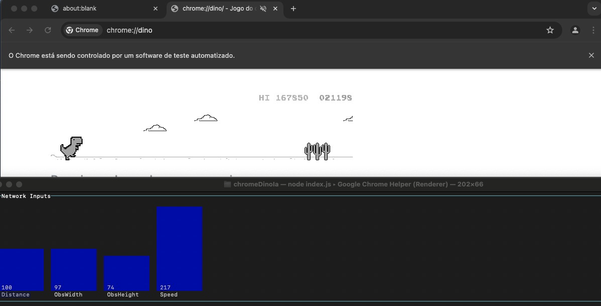

# Projeto Dino IA

**Referência:** Este projeto utilizou como base e inspiração o projeto [IAMDinosaur](https://github.com/ivanseidel/IAMDinosaur/tree/master), de Ivan Seidel, que demonstra uma abordagem para criar um agente que joga o jogo do dinossauro do Chrome. Foram realizadas alterações no projeto original, pois algumas bibliotecas utilizadas estavam descontinuadas ou sem atualização há um bom tempo. Para mais detalhes, consulte a seção [Modificações do Projeto](#modificações-do-projeto).

---

## Sumário

- [Projeto Dino IA](#projeto-dino-ia)
  - [Sumário](#sumário)
  - [Visão Geral](#visão-geral)
  - [Modificações do Projeto](#modificações-do-projeto)
  - [Testes](#testes)
  - [Integração com o Jogo](#integração-com-o-jogo)
  - [Leitura dos Sensores](#leitura-dos-sensores)
  - [Treinamento e Evolução](#treinamento-e-evolução)
  - [Arquitetura da Rede Neural](#arquitetura-da-rede-neural)
  - [Funções e Camadas da Rede](#funções-e-camadas-da-rede)
  - [Como Executar o Projeto](#como-executar-o-projeto)
  - [Como Realizar um Treinamento](#como-realizar-um-treinamento)
    - [Alguns Atalhos](#alguns-atalhos)
  - [Dependências](#dependências)
  - [Licença](#licença)
  - [Considerações Finais](#considerações-finais)

## Visão Geral

O projeto utiliza uma abordagem de algoritmos evolutivos para treinar uma rede neural que decide qual ação executar no jogo do dinossauro do Chrome. O objetivo é treinar o agente para tomar decisões (pular, agachar ou manter-se normal) de acordo com as condições do jogo, baseando-se em dados coletados em tempo real através de sensores.

## Modificações do Projeto

Nesta seção, destacamos as principais modificações realizadas em relação à abordagem original:

- **De Synaptic para TensorFlow.js:**  
  A implementação original utilizava o Synaptic para construir e treinar a rede neural, empregando o método `Architect.Perceptron`. Nesse modelo:
  - **Tipo de Camadas:**  
    Camadas totalmente conectadas (equivalentes às "dense" em outras bibliotecas).
  - **Função de Ativação:**  
    Por padrão, utilizava a função sigmoide (logística) em todos os neurônios, dada por:  
    \[
    \sigma(x) = \frac{1}{1 + e^{-x}}
    \]
    Essa função mapeava as ativações para o intervalo (0, 1).
  - **Função de Perda / Critério de Treinamento:**  
    O treinamento era feito via algoritmos evolutivos, onde a aptidão (fitness) de cada rede era definida pela pontuação no jogo.
  
  Agora, com a migração para o [TensorFlow.js](https://www.tensorflow.org/js), a rede neural é implementada da seguinte forma:
  - **Tipo de Camadas:**  
    São utilizadas camadas "dense" (totalmente conectadas) definidas por `tf.layers.dense`.
  - **Arquitetura e Função de Ativação:**  
    - Uma camada oculta com 4 neurônios utilizando a função de ativação **ReLU**, definida por:
      \[
      f(x) = \max(0, x)
      \]
    - Uma camada de saída com 3 neurônios utilizando a função de ativação **Softmax**, que converte os valores brutos em uma distribuição de probabilidades.
  - **Compilação do Modelo:**  
    O modelo é compilado com o **otimizador Adam** e a **função de perda categoricalCrossentropy**, adequada para problemas de classificação com múltiplas classes.
  
- **Substituição do Robot por Puppeteer:**  
  O framework originalmente utilizado para a automação do jogo foi descontinuado. Optamos pelo [Puppeteer](https://pptr.dev/), amplamente adotado para controlar navegadores de forma programática, proporcionando uma integração mais robusta com o jogo do dinossauro.

- **Extração de Dados do Runner:**  
  Ao invés de utilizar a leitura de pixels para identificar elementos no jogo e tomar decisões — o que podia ser impreciso e exigir um processamento mais complexo — a abordagem atual extrai os dados diretamente do objeto do jogo. Essa modificação melhora a precisão dos dados coletados e simplifica a normalização e o processamento dos inputs para a rede neural.  
  **Comparação:**  
  - **Antes:** Leitura de pixels para capturar informações visuais, com maior processamento necessário para identificar elementos.  
  - **Agora:** Extração direta dos dados do objeto Runner, proporcionando coleta mais precisa e processamento mais simples.

## Testes

Durante o desenvolvimento, foram testadas diversas configurações de rede para determinar a melhor arquitetura para o problema. Abaixo, um resumo dos experimentos realizados:

- **Primeiro Teste:**  
  - **Arquitetura:**  
    - Entradas: 3 neurônios (distância, tamanho do obstáculo, velocidade)  
    - Camadas Ocultas: Duas camadas com 4 neurônios cada, utilizando ReLU  
    - Saída: 1 neurônio com ativação Sigmoid  
  - **Compilação:** Utilizou meanSquaredError  
  - **Resultados:**  
    - A rede atingiu uma pontuação próxima de 20 mil pontos.  
    - O treinamento levou mais de 1 dia, totalizando 84 gerações.  
    - Conclusão: A rede possivelmente estava complexa demais para um jogo tão simples.

- **Segundo Teste:**  
  - **Arquitetura:**  
    - Entradas: 5 neurônios (distância, tamanho do obstáculo, largura do obstáculo, altura do dinossauro – para indicar se estava pulando ou não –, e velocidade) utilizando ReLU  
    - Camadas Ocultas: Duas camadas com 8 neurônios cada  
    - Saídas: 2 neurônios com ativação Softmax  
  - **Compilação:** Utilizou Adam e categoricalCrossentropy  
  - **Resultados:**  
    - A complexidade aumentada fez com que a rede não conseguisse aprender de forma adequada.  
    - Após apenas 15 gerações, a rede ainda tomava decisões aleatórias, como pular sem critério e não conseguiu alcançar nem 100 pontos.

- **Terceiro Teste (Rede Simplificada):**  
  - **Arquitetura:**  
    - Entradas: 4 neurônios (simplificando os inputs necessários)  
    - Camada Oculta: Uma camada com 4 neurônios  
    - Saídas: 3 neurônios (um para cada ação do jogo – pular, agachar, ou manter-se normal) com ativação Softmax  
  - **Compilação:** Utilizou Adam e categoricalCrossentropy  
  - **Resultados:**  
    - A rede apresentou uma melhora significativa: a partir do 6º ou 7º genoma da primeira geração, já conseguia correlacionar a distância do obstáculo e tomar a decisão de pular nos primeiros cactos.  
    - Em menos de 30 minutos de treinamento, a rede atingiu uma pontuação de 27 mil pontos.

**Conclusão dos Testes:**  
Os experimentos evidenciaram que uma arquitetura mais simples (com menos neurônios de entrada e uma única camada oculta) foi a melhor opção para este problema, proporcionando um aprendizado mais rápido e eficaz para as ações do jogo.

## Integração com o Jogo

A integração com o jogo do dinossauro do Chrome é realizada através da injeção de código no ambiente do navegador. Por meio do Puppeteer (ou outra ferramenta de automação), o projeto interage com o jogo para ajustar parâmetros, como a velocidade inicial, e para extrair dados essenciais.

*Exemplo:* Após a rede aprender a lidar com velocidades mais baixas, o jogo pode ser configurado para iniciar na última velocidade em que o dinossauro morreu durante o treinamento, permitindo que ele treine já na velocidade máxima alcançada. Isso acelera o aprendizado ao evitar a fase de velocidades mais baixas.

## Leitura dos Sensores

O módulo de leitura dos sensores extrai informações fundamentais do jogo para alimentar a rede neural. Esses dados incluem:

- **Posição do Dinossauro:**  
  Obtida a partir das propriedades do objeto do jogo.

- **Obstáculos:**  
  Uma lista de obstáculos presentes no cenário, com detalhes sobre posição, largura e altura.

- **Velocidade e Distância:**  
  A velocidade atual do jogo e a distância até o obstáculo mais próximo. A velocidade é normalizada em relação ao valor máximo observado para garantir consistência nos dados de entrada.

*Exemplo:* Se a velocidade atual for maior que a velocidade máxima observada, esta é atualizada e a velocidade é normalizada dividindo o valor atual pelo valor máximo observado.

## Treinamento e Evolução

O treinamento do agente é realizado utilizando algoritmos evolutivos, onde cada "genoma" representa um conjunto de pesos da rede neural. O processo envolve:

- **Seleção:**  
  Modelos com melhor performance no jogo têm maior chance de serem selecionados para a próxima geração.

- **Crossover e Mutação:**  
  Características dos melhores modelos são combinadas e pequenas alterações (mutações) são introduzidas para explorar novas soluções e evitar convergência prematura.

Esse método evolutivo é repetido por várias gerações, permitindo que o agente se adapte a desafios progressivamente mais difíceis, como velocidades maiores e obstáculos mais complexos.

## Arquitetura da Rede Neural

A rede neural utilizada possui uma arquitetura simples, porém eficaz para o problema em questão. Segue a estrutura utilizada:

- **Entradas:**  
  O número de inputs corresponde aos sensores do ambiente, que incluem:
  - Distância até o obstáculo mais próximo.
  - Largura do obstáculo.
  - Altura do obstáculo.
  - Velocidade do jogo.
  
- **Camadas da Rede:**  
  1. **Camada de Entrada e Primeira Camada Oculta:** Dense com 4 neurônios e ativação ReLU.
  2. **Camada de Saída:** Dense com 3 neurônios e ativação Softmax.
  
- **Compilação do Modelo:**  
  O modelo é compilado utilizando:
  - Otimizador: Adam.
  - Função de perda: categoricalCrossentropy.

## Funções e Camadas da Rede

- **Camada densa (Dense):**  
  As camadas densas são blocos fundamentais da rede neural, onde cada neurônio está conectado a todos os neurônios da camada anterior. Essa estrutura permite que a rede capture padrões complexos por meio de uma combinação linear seguida de uma função de ativação.

- **ReLU (Rectified Linear Unit):**  
  - **Definição:** f(x) = max(0, x)  
  - **Benefícios:**  
    - Introduz não-linearidade de forma simples.
    - Evita a propagação de gradientes negativos, acelerando o treinamento.
    - Reduz problemas de desvanecimento do gradiente.

- **Softmax:**  
  - **Definição:**  
    σ(z)_i = e^(z_i) / Σ_j e^(z_j)
  - **Benefícios:**  
    - Converte os outputs em probabilidades.
    - Facilita a interpretação dos resultados, pois a soma das probabilidades é 1.

- **Adam (Adaptive Moment Estimation):**  
  - **Descrição:** Combina técnicas do AdaGrad e RMSProp, ajustando a taxa de aprendizado individualmente para cada parâmetro.
  - **Benefícios:**  
    - Melhora a velocidade de convergência.
    - Funciona bem com problemas não estacionários e dados ruidosos.

- **Categorical Crossentropy:**  
  - **Descrição:** Função de perda utilizada para medir a discrepância entre as distribuições previstas e as reais.
  - **Benefícios:**  
    - Penaliza fortemente previsões imprecisas.
    - É ideal para problemas de classificação com múltiplas classes.

## Como Executar o Projeto

1. **Pré-requisitos:**
   - Instale o Node.js em seu computador.
   - Certifique-se de que o npm esteja instalado.

2. **Instalação:**
   - Clone ou faça o download deste repositório para o seu computador.
   - Abra um terminal na pasta do projeto.
   - Execute o comando `npm install` para instalar todas as dependências.

3. **Configuração Inicial:**
   - Abra o jogo do dinossauro do Chrome.
   - Mantenha o terminal na mesma tela do jogo
4. **Execução:**
   - No terminal, execute o comando `npm start` ou `node index.js`.
   - Se o jogo for localizado, o cursor do mouse será movido para a origem do chão do dinossauro.
   - Após a execução, pressione a tecla **s** no terminal para iniciar o treinamento.

5. **Monitoramento e Debug:**
   - O projeto inclui uma interface de debug que sobrepõe informações no canvas do jogo, exibindo dados dos sensores e ativações em tempo real. No arquivo `GameManipulator.js`, basta definir a variável `debug` como `true`.
   - Logs são gerados no console para facilitar o acompanhamento do progresso do treinamento.

## Como Realizar um Treinamento

- Certifique-se de que o genoma esteja dentro da pasta `genomes` com a extensão `.json`.
- Execute o programa.
- No terminal, clique na lista exibida.
- Navegue para cima/para baixo até encontrar o arquivo desejado.
- Pressione **Enter** para selecionar o arquivo e, em seguida, pressione **s** para iniciar o treinamento.

### Alguns Atalhos

- Para salvar a geração atual, pressione **o**.
- Para finalizar o processo, pressione **Escape**, **q** ou **Ctrl+C**.

## Dependências

- [@tensorflow/tfjs](https://www.npmjs.com/package/@tensorflow/tfjs)
- [blessed](https://www.npmjs.com/package/blessed)
- [blessed-contrib](https://www.npmjs.com/package/blessed-contrib)
- [puppeteer](https://www.npmjs.com/package/puppeteer)

## Licença

Este projeto está licenciado sob a [MIT License](LICENSE).

---

## Considerações Finais

Este projeto demonstra a aplicação de algoritmos evolutivos combinados com redes neurais para resolver um problema dinâmico e desafiador. A abordagem modular adotada permite ajustes tanto na arquitetura da rede quanto nos parâmetros do ambiente, possibilitando experimentação e melhorias contínuas.

Contribuições e sugestões são bem-vindas!
